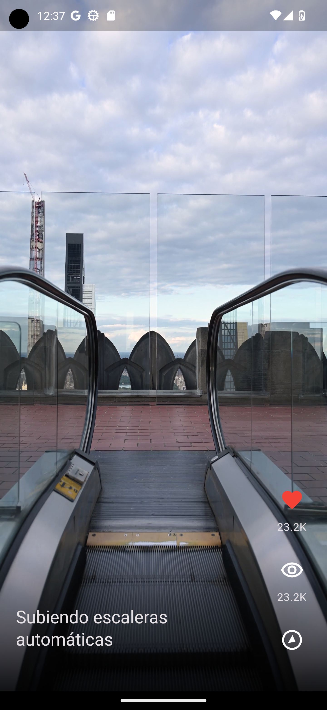
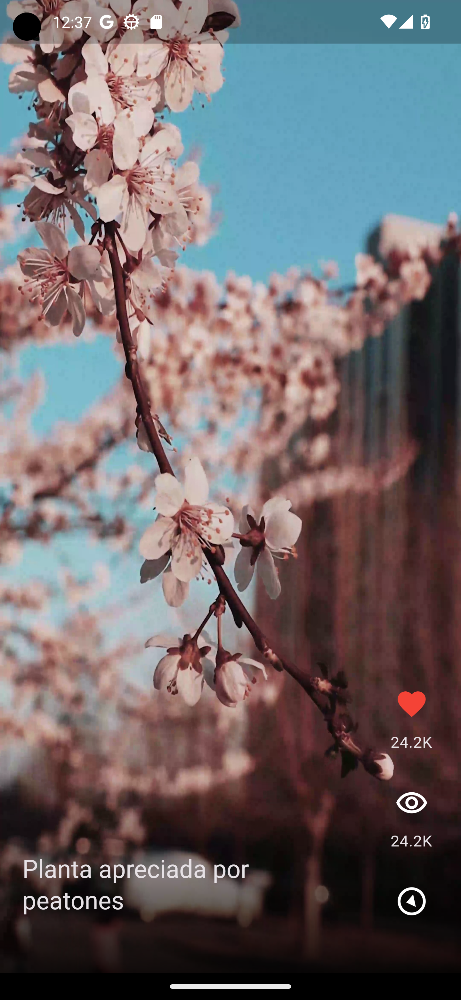

# toktik

A Tiktok's Clone made in Flutter using local videos.

_¿Why is it usefull this project ?_

This project use a base of Clean Architecture, where you can see how to implement it in a Flutter project.

I use domain, data and presentation layers, and also I use a dependency injection.

## Getting Started

For using this project, you need to have installed Flutter in your computer, and then, you can clone this repository.

```bash
git clone
```

Then, you need to use some videos in your device, and put them in the folder `assets/videos`.

Finally, you can run the project in your device.

```bash

I strongly recommend you to use Android Studio or Visual Studio Code for running this project.

## Screenshots



```
